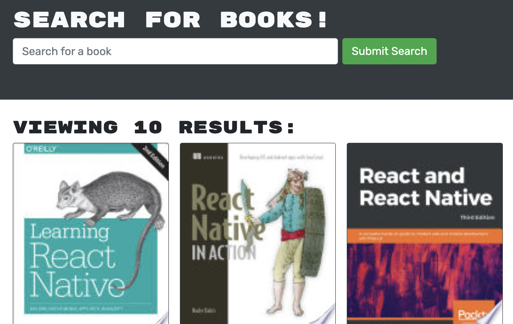
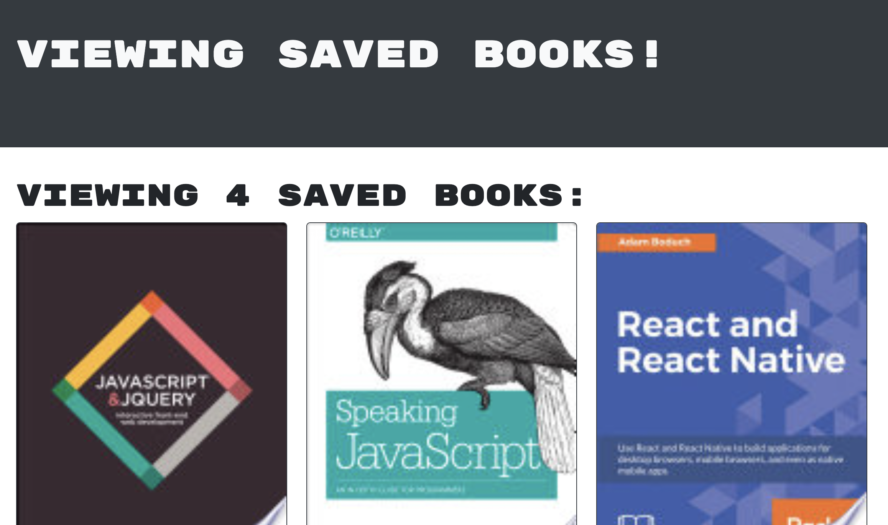

# Google Book Search

    ##Table of Contents
   
[Description](#description)
    
[Technologies](#technologies-used)
    
[Usage](#usage)

[Screenshots](#screenshots)   
 
[Questions](#questions)
    
## Description
    
A fully functional Google Books search engine that was refractured from RestFull API to a GraphQL API with Apollo Server. 
    
## Technologies Used

    
## Usage
    
Create an account by clicking on the login button and filling out the sign up form. Now when you search for a book, you have the ability to save your seached books and view them in the the  `see your books` tab. You can delete the saved books by clicking the `delete this book` button below the book.

    
## Screenshots
### Landing Page

### Search a Book

### Your Saved Books

## Questions
Any questions, comments, or concerns please contact me at ckratz17@gmail.com

## GitHub
(https://github.com/Ckratz17/Book_Search_Engine)

